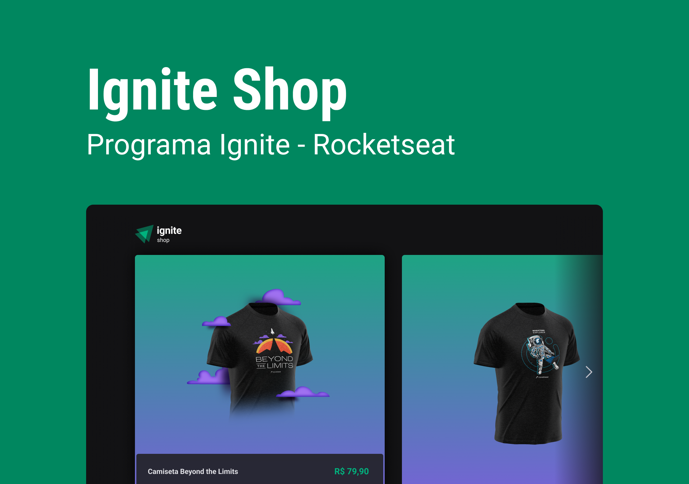
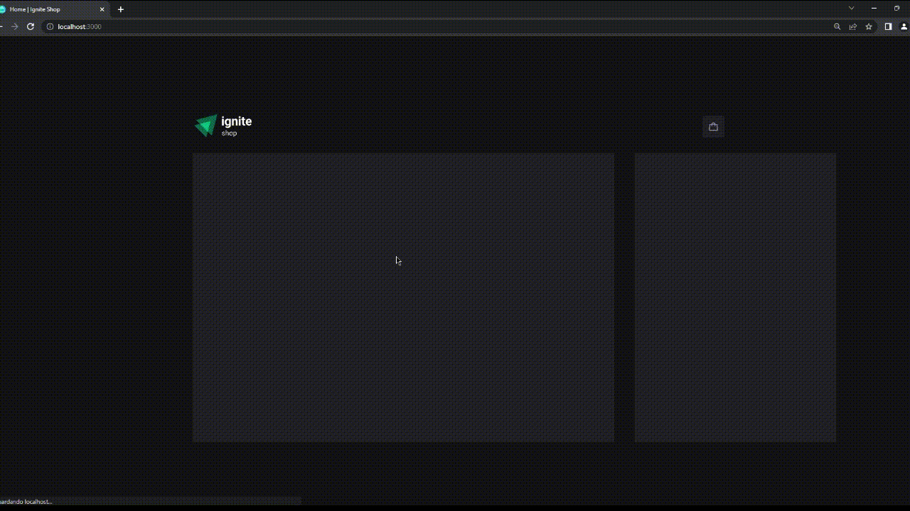

<div align="center">
  <h1> Ignite Shop </h1>
</div> 

<div align="center">
  <a href="#-Technologies"><b>Technologies</b></a>&nbsp;&nbsp;&nbsp;|&nbsp;&nbsp;&nbsp;
  <a href="#-Project"><b>Project</b></a>&nbsp;&nbsp;&nbsp;|&nbsp;&nbsp;&nbsp;
  <a href="#-Layout"><b>Layout</b></a>&nbsp;&nbsp;&nbsp;
</div>

<br></br>

<div align="center">
  
  
</div> 

</br>

## 🚀 Getting started

Clone the project and access the folder.

```bash
$ git clone https://github.com/diaspd/ignite-shop.git
$ cd 
```

## Installation

```bash
$ npm install
```

## Running the app

```bash
$ npm run dev
```

</br>

## Setting the app
To connect to Stripe you will need to create a `.env.local` file and add 

```
- NEXT_URL=https://localhost:3000

// and 2 keys for Stripe:
- STRIPE_PUBLIC_KEY=YOUR_PUBLIC_KEY
- STRIPE_SECRET_KEY=YOUR_SECRET_KEY
```

The app will be available on `http://localhost:3000`

<br></br>

## 💻 Technologies

This project was developed with the following technologies:
<b>
- Next Js
- Stitches
- Type Script
- Stripe
</b>

</br>

## 📄 Project
💰 Project like a online shop.

<br></br>

## 🔖 Layout
- [Ignite Shop - Figma](https://www.figma.com/file/FxlDRKOmznBbTH8DsTgnZU/Ignite-Shop-2.0/duplicate)

<br></br>

Made with ♥ by Pedro Dias. 👋 Follow me on social media! </br>

If you can give a little star, I appreciate it 🤩
